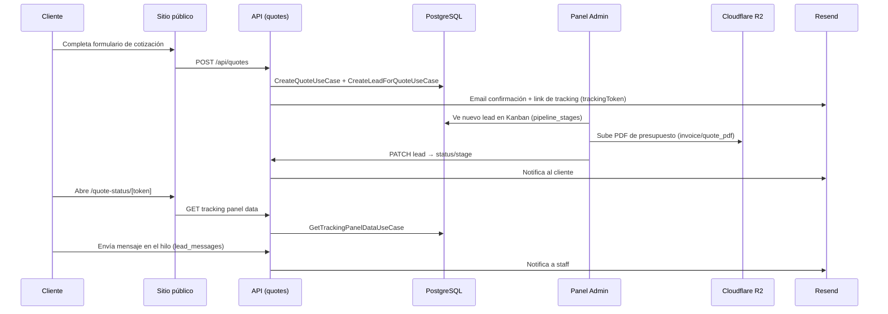
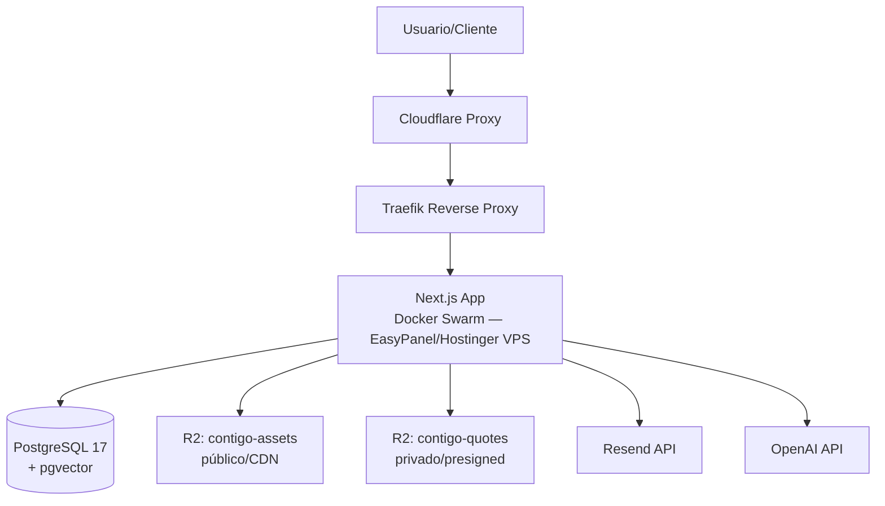

# 01 — Arquitectura del Sistema
**Contigo Constructions Platform · Entrega v1.0**
**Repo:** `github.com/zipnegocios/contigo-platform` · Rama `main` · Commit de corte `97d32f7` + hardening de auth

---

## 1. Visión general

Contigo Platform es una aplicación **Next.js 15 (App Router)** full-stack que combina:

1. Un **sitio público de marketing y portafolio** (marca, servicios, proyectos, formulario de cotización).
2. Un **panel de cliente sin autenticación** (`/quote-status/[token]`) para seguimiento de cotizaciones.
3. Un **CMS / CRM administrativo** protegido (`/admin/**`) donde el equipo de Contigo gestiona leads, proyectos, servicios, contenido y su propio staff.
4. Una **capa de API** (87 endpoints) que conecta ambos frentes con la base de datos y servicios externos.

```mermaid
flowchart LR
    subgraph Público
        A[Sitio Marketing<br/>app/(marketing)]
        B[Portafolio<br/>app/(portfolio)]
        C[Panel Cliente<br/>/quote-status/token]
    end
    subgraph Admin
        D[Dashboard CRM<br/>app/admin/(protected)]
    end
    subgraph API["Capa API — app/api/** (87 endpoints)"]
        E[Rutas públicas]
        F[Rutas admin<br/>protegidas por sesión]
    end
    subgraph Dominio
        G[src/application<br/>50 casos de uso]
        H[src/core<br/>19 entidades + interfaces]
    end
    subgraph Infraestructura
        I[(PostgreSQL 17<br/>+ pgvector)]
        J[Cloudflare R2]
        K[Resend Email]
        L[OpenAI Embeddings]
    end

    A --> E
    B --> E
    C --> E
    D --> F
    E --> G
    F --> G
    G --> H
    H --> I
    G --> J
    G --> K
    G --> L
```

---

## 2. Arquitectura por capas (Clean Architecture / DDD-like)

El proyecto sigue una separación en 4 capas dentro de `src/`:

```
src/core/           → Entidades de dominio, interfaces de repositorio, value objects
src/application/    → Casos de uso (orquestan entidades + repositorios)
src/infrastructure/ → Implementaciones Drizzle, servicios externos, auth, DB client
src/presentation/   → Componentes React, secciones, hooks, animaciones
```

**Flujo de datos en el camino correcto** (dominio Leads/Quotes/Tasks/Staff/Pipeline — 100% de estos módulos):

```
Route Handler (app/api/**)
   → Validación Zod
   → Caso de uso (instanciado manualmente, sin contenedor DI)
   → Interfaz de repositorio (src/core/repositories)
   → Implementación Drizzle (src/infrastructure/repositories)
   → PostgreSQL
```

Ejemplo trazable: `app/api/quotes/route.ts` → `CreateQuoteSchema` (Zod) → `CreateQuoteUseCase` / `CreateLeadForQuoteUseCase` → `IQuoteRepository` / `ILeadRepository` → `DrizzleQuoteRepository` / `DrizzleLeadRepository`.

**Excepción arquitectónica conocida — dominio Catálogo:** las rutas de `projects`, `services`, `categories`, además de las de `media` y `change-password`, acceden **directamente** a `Drizzle*Repository` o incluso a `db` crudo, sin pasar por caso de uso ni por Zod en la mayoría de los casos. Es un atajo estructural documentado desde la auditoría del 24-jun-2026 y **no corregido en esta entrega** (ver Doc 06, sección de deuda técnica, para el plan de remediación).

**Acoplamiento medido:**
- Bajo entre `presentation` y `core`/`application` — no se encontraron imports cruzados.
- Alto y directo entre `app/api/**` y Drizzle en el dominio Catálogo — es el patrón de acoplamiento más relevante a vigilar en mantenimiento.

---

## 3. Inventario de la capa de dominio

| Capa | Cantidad | Ubicación |
|---|---|---|
| Entidades | 19 | `src/core/entities/` |
| Interfaces de repositorio | 19 | `src/core/repositories/` |
| Implementaciones Drizzle | 21 | `src/infrastructure/repositories/` |
| Casos de uso | 50 | `src/application/use-cases/` |
| Servicios de infraestructura | 5 | `src/infrastructure/services/` |

**Casos de uso por dominio:**

| Dominio | # Casos de uso | Ejemplos |
|---|---|---|
| Leads | 25 | `CreateLeadForQuoteUseCase`, `ChangeLeadStageUseCase`, `ArchiveLeadUseCase`, `TrashLeadUseCase`, `DeleteLeadPermanentlyUseCase` |
| Tasks | 13 | `CreateTaskUseCase`, `AddChecklistItemUseCase`, `AssignTaskUseCase`, `AddTaskCommentUseCase` |
| Staff | 4 | `CreateStaffUserUseCase`, `SetStaffPermissionsUseCase`, `DeactivateStaffUserUseCase` |
| Portal (cliente) | 4 | `GetTrackingPanelDataUseCase`, `PostClientMessageUseCase`, `GetLeadNotificationFeedUseCase` |
| Pipeline | 3 | `CreatePipelineStageUseCase`, `ReorderPipelineStagesUseCase`, `RenamePipelineStageUseCase` |
| Quotes | 1 | `CreateQuoteUseCase` |

**Servicios de infraestructura:**

| Servicio | Responsabilidad |
|---|---|
| `ResendEmailService` | Envío de correos transaccionales (confirmaciones, notificaciones de mensajes, presupuesto listo) |
| `R2StorageService` | Presigned URLs de subida/descarga contra Cloudflare R2 |
| `OpenAIEmbeddingService` | Generación de embeddings para búsqueda semántica (write-path activo; read-path de recomendaciones aún no habilitado en producción) |
| `SlugGeneratorService` | Generación de slugs únicos para proyectos/servicios/categorías |
| `MediaReferenceService` | Resolución de referencias cruzadas entre Media Library y otras entidades |

---

## 4. Rutas de la aplicación (App Router)

```
app/
├── (marketing)/                 Landing pública: hero, servicios, proyectos, contacto
├── (portfolio)/
│   ├── about/
│   ├── projects/[slug]/
│   └── services/[category]/[item]/
├── admin/
│   ├── login/                   Público
│   └── (protected)/             Requiere sesión NextAuth (JWT)
│       ├── categories/  hero/  leads/  media/  projects/  services/  settings/
│       └── leads/management/{form-builder,staff}/
├── api/
│   ├── admin/**                 71 rutas — todas protegidas
│   ├── quotes, categories, projects, forms, health   Rutas públicas
│   └── quote-status/[token]/**  Portal cliente por capability URL (sin login)
└── quote-status/[token]/        Página del panel de cliente
```

**Patrón de protección:** `middleware.ts` intercepta `/admin/:path*`, exige `req.auth` (sesión NextAuth) y redirige a `/admin/login` si no existe, preservando `callbackUrl`. Las rutas API bajo `/api/admin/**` verifican la sesión **dentro de cada handler** (`auth()` in-handler), no solo vía middleware — patrón redundante pero intencional para que cada endpoint sea seguro incluso si se invoca fuera del árbol de páginas cubierto por el matcher.

---

## 5. Autenticación y autorización

- **Proveedor:** NextAuth v5 (beta), únicamente `CredentialsProvider` (sin OAuth social).
- **Hashing:** bcryptjs, con recomputación transparente de costo (ver Doc 06 para detalle post-hardening).
- **Sesión:** JWT, expiración reducida en el hardening de esta entrega (antes 7 días).
- **RBAC:** dos roles base (`owner`, `staff`) más un sistema de permisos granulares (`permissions` + `staff_user_permissions`) que permite otorgar capacidades específicas (`leads.view`, `leads.edit`, etc.) a usuarios `staff` sin tocar código.
- **Invitación de staff:** flujo por token de invitación de un solo uso (reemplaza la creación directa con contraseña temporal).
- **Recuperación de contraseña:** tokens hasheados de un solo uso + `sessionVersion` para invalidar sesiones JWT activas al cambiar contraseña.
- **Bloqueo de cuenta:** lockout por intentos fallidos con tiempos de respuesta uniformes (mitiga enumeración de usuarios).
- **Auditoría:** tabla de eventos de seguridad para inicios de sesión, bloqueos, cambios de permisos.

> 2FA y Content-Security-Policy quedan explícitamente fuera de esta entrega — documentados como roadmap técnico en el Doc 06.

---

## 6. Flujo E2E de referencia: de solicitud a presupuesto



---

## 7. Realtime

La notificación entre cliente y staff usa **Server-Sent Events (SSE)** (`src/infrastructure/realtime/createSSEStream.ts`), reemplazando el polling inicial del MVP. Endpoints con sufijo `/stream` (mensajes, notificaciones, estado, calendario) mantienen una conexión abierta y emiten eventos cuando cambia el estado subyacente.

---

## 8. Diagrama de contenedores (infraestructura de alto nivel)



Ver Doc 04 para el detalle operativo completo de este diagrama.

---

## 9. Referencias cruzadas

- Diccionario de datos completo → **Doc 02 — Base de Datos**
- Detalle de los 87 endpoints → **Doc 03 — API Reference**
- Runbook de despliegue → **Doc 04 — Infraestructura y Operación**
- Mapa "dónde se modifica cada módulo" → **Doc 05 — Módulos Funcionales**
- Deuda técnica y plan de escalamiento → **Doc 06 — Mantenibilidad y Escalamiento**
