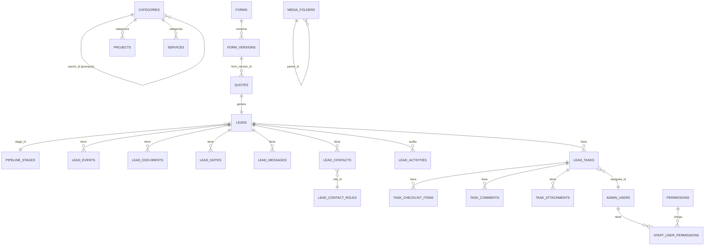

# 02 — Base de Datos
**Contigo Constructions Platform · Entrega v1.0**
**Motor:** PostgreSQL 17 (imagen `pgvector/pgvector`) · **ORM:** Drizzle · **Esquema fuente:** `src/infrastructure/db/schema.ts`

---

## 1. Resumen

- **26 tablas**, **14 enums**, **34 migraciones** aplicadas (`src/infrastructure/db/migrations/`).
- Extensión `pgvector` instalada para soportar embeddings de texto (columnas `description_vector` en `quotes` y `projects`), usada en el **write-path**; el read-path de recomendaciones semánticas automáticas está diseñado pero no habilitado en producción (ver Doc 06, roadmap).
- Convención consistente de **soft-delete**: la mayoría de las tablas usa `archived_at` y/o `trashed_at` en lugar de `DELETE` físico. El borrado permanente existe solo para `leads` vía un caso de uso explícito (`DeleteLeadPermanentlyUseCase`), no por defecto.
- Todas las claves primarias son `uuid` autogenerado (`defaultRandom()`), excepto `permissions.key` (varchar, catálogo fijo) y la PK compuesta de `staff_user_permissions`.

---

## 2. Enums

| Enum | Valores |
|---|---|
| `quote_status` | `new`, `contacted`, `in_progress`, `converted`, `closed` |
| `project_status` | `draft`, `active`, `inactive` |
| `service_status` | `draft`, `active`, `inactive` |
| `category_status` | `draft`, `active`, `inactive` |
| `lead_stage` *(deprecado)* | `prospect`, `contacted`, `quoted`, `won`, `lost` — reemplazado por `pipeline_stages` (tabla dinámica) |
| `admin_role` | `owner`, `staff` |
| `lead_event_type` | `call`, `site_visit`, `meeting`, `follow_up` |
| `lead_event_status` | `scheduled`, `completed`, `cancelled`, `no_show` |
| `lead_document_direction` | `client_upload`, `admin_sent`, `internal` |
| `lead_document_category` | `reference_photo`, `site_photo`, `quote_pdf`, `contract`, `other`, `invoice` |
| `lead_contact_role` *(deprecado)* | `owner`, `site_manager`, `spouse`, `other` — reemplazado por `lead_contact_roles` (tabla dinámica) |
| `lead_activity_type` | 17 valores — ver §5 |
| `task_status` | `open`, `in_progress`, `done` |
| `lead_message_author` | `client`, `staff` |

> **Nota de diseño importante:** `lead_stage` y `lead_contact_role` fueron migrados de enum a **tabla real** (`pipeline_stages`, `lead_contact_roles`) para permitir que el admin cree/renombre/reordene valores desde la UI sin requerir `ALTER TYPE` ni despliegue. Las columnas enum originales (`leads.stage`, `lead_contacts.role`) se mantienen en el esquema por retrocompatibilidad de migración, pero la aplicación ya no las usa como fuente de verdad — leer siempre `stageId` / `roleId`. **Antes de tocar código de estado de leads, confirmar que se está leyendo el campo FK, no el enum legado.**

---

## 3. Diccionario de tablas

### Catálogo / Contenido público

| Tabla | Propósito | Campos clave | Soft-delete |
|---|---|---|---|
| `categories` | Taxonomía jerárquica de servicios/proyectos (auto-referencial vía `parent_id`) | `slug`, `type`, `status`, `order_index`, `is_system` | `trashed_at` |
| `services` | Los 4 rubros + ítems de servicio (30 seeded) | `slug`, `page_blocks` (JSON, page builder visual), `category_id`, `request_form_id` (hook a Form Builder, sin lógica aún) | `trashed_at` |
| `projects` | Portafolio de obras ejecutadas | `slug`, `gallery_urls`, `description_vector` (embedding), `featured`, `order_index` | `trashed_at` |
| `hero_config` | Fila única (singleton) que controla el hero de home | `mode`, `slides` (JSON), `autoplay_interval` | — |

### Formularios dinámicos

| Tabla | Propósito |
|---|---|
| `forms` | Catálogo de formularios publicables (ej. "Request a Quote") |
| `form_versions` | Versión inmutable del JSON-schema del formulario; cada guardado del builder crea una fila nueva, nunca edita in-place |

### Cotizaciones y CRM (Leads)

| Tabla | Propósito | Campos clave |
|---|---|---|
| `quotes` | Solicitud original del cliente (público) | `tracking_token` (UUID capability URL), `status`, `form_version_id`, `form_data` (JSON crudo del submit) |
| `leads` | Entidad CRM 1:1 con `quotes`, creada automáticamente al enviar cotización | `stage_id` (FK activa), `stage` (legado), `estimated_value` (cents), `archived_at`, `trashed_at` |
| `pipeline_stages` | Etapas configurables del Kanban | `key`, `label`, `position`, `color`, `terminal_kind` (`won`/`lost`/null) |
| `lead_events` | Llamadas, visitas, reuniones agendadas | `type`, `scheduled_at`, `status`, `location` |
| `lead_documents` | Documentos/fotos asociados (incluye categoría `invoice` agregada en el MVP del panel de cliente) | `direction`, `category`, `file_key` (R2) |
| `lead_notes` | Notas internas del staff | `body`, `created_by` |
| `lead_messages` | Hilo de mensajería bidireccional cliente↔staff | `author_type`, `read_at` |
| `lead_contacts` | Contactos asociados al lead (puede haber más de uno) | `role_id` (FK activa), `role` (legado), `is_primary` |
| `lead_activities` | Timeline de auditoría automática (17 tipos de evento) | `type`, `payload` (JSON), `created_by` |
| `lead_contact_roles` | Catálogo dinámico de roles de contacto | `key`, `label`, `is_default` |

### Tareas (Tasks)

| Tabla | Propósito |
|---|---|
| `lead_tasks` | Tareas asociadas a un lead | `status`, `due_date`, `assignee_id` |
| `task_checklist_items` | Ítems de checklist dentro de una tarea | `position`, `is_checked` |
| `task_comments` | Comentarios sobre una tarea | `body`, `edited_at` |
| `task_attachments` | Adjuntos de tarea (R2 o Media Library) | `key`, `filename` |

### Media Library

| Tabla | Propósito |
|---|---|
| `media_folders` | Estructura de carpetas (auto-referencial) |
| `media_tags` | Etiquetas de color para clasificar archivos |
| `media_metadata` | Metadata técnica por archivo (dimensiones, formato, si fue optimizado) |

### Staff / Seguridad

| Tabla | Propósito |
|---|---|
| `admin_users` | Usuarios del panel (owner/staff) | `password_hash`, `is_active`, `last_login` |
| `permissions` | Catálogo fijo de permisos granulares (`leads.view`, `leads.edit`, etc.) |
| `staff_user_permissions` | Tabla puente usuario↔permiso (PK compuesta) |

> Esta sección documenta el esquema base. Las tablas/columnas agregadas específicamente por el work order de auth hardening (tokens de invitación, tokens de recuperación, `session_version`, tabla de eventos de seguridad) deben verificarse contra la migración real una vez confirmado el merge — anotado como pendiente de verificación en Doc 06.

---

## 4. Relaciones (ER simplificado)

---

## 5. `lead_activity_type` — los 17 tipos de evento auditado

`stage_change`, `note`, `call_scheduled`, `call_completed`, `call_cancelled`, `visit_scheduled`, `visit_completed`, `visit_cancelled`, `event_scheduled`, `event_completed`, `event_cancelled`, `document_uploaded`, `document_sent`, `email_sent`, `quote_status_changed`, `message_received`, `message_sent`.

Esta tabla es la fuente del timeline visible en el detalle de cada lead — cualquier acción relevante del CRM debería, por convención, insertar una fila aquí.

---

## 6. Estrategia de migraciones

- **Herramienta:** `drizzle-kit`. Comandos: `npm run db:push` (desarrollo, sin migración versionada), `npm run db:migrate` (producción, aplica journal), `npm run db:studio` (explorador visual).
- **Migraciones huérfanas detectadas:** `0000_init_pgvector.sql` y `0001_hierarchical_categories.sql` existen en disco pero **no están en el journal** de Drizzle — no se ejecutan vía `db:migrate`. Se recomienda archivarlas fuera de `migrations/` con nota histórica, no borrarlas, hasta confirmar que ningún entorno depende de ellas (ver Doc 06).
- **Script de pgvector duplicado:** `scripts/setup-pgvector.mjs` (registra que pgvector NO se usa) vs `scripts/setup-pgvector.ts` (invocado por `db:setup`, sí crea la extensión). Nombres casi idénticos con comportamiento opuesto — riesgo de confusión operativa documentado, sin corregir en esta entrega.

---

## 7. Índices

El esquema define **más de 40 índices explícitos** (`index(...)` en Drizzle), principalmente sobre:
- Columnas de filtro frecuente en el admin: `status`, `stage_id`, `archived_at`, `trashed_at`.
- Columnas de búsqueda: `slug`, `email`, `tracking_token`.
- Columnas de ordenamiento: `order_index`, `position`, `created_at`.

No hay índices `ivfflat`/`hnsw` sobre las columnas `description_vector` — si se activa el read-path de pgvector (roadmap), este es un prerequisito de performance a agregar.

---

## 8. Dónde se modifica

| Necesidad | Archivo |
|---|---|
| Agregar/modificar una tabla o columna | `src/infrastructure/db/schema.ts` → correr `npm run db:push` (dev) o generar migración con `drizzle-kit generate` (prod) |
| Agregar un enum nuevo | `pgEnum(...)` en el mismo archivo, junto a los existentes en la sección `// ============ ENUMS ============` |
| Ver el estado real de una tabla sin escribir SQL | `npm run db:studio` |
| Repositorio de acceso a una tabla | `src/infrastructure/repositories/Drizzle<Entidad>Repository.ts` |
| Interfaz que ese repositorio implementa | `src/core/repositories/I<Entidad>Repository.ts` |
